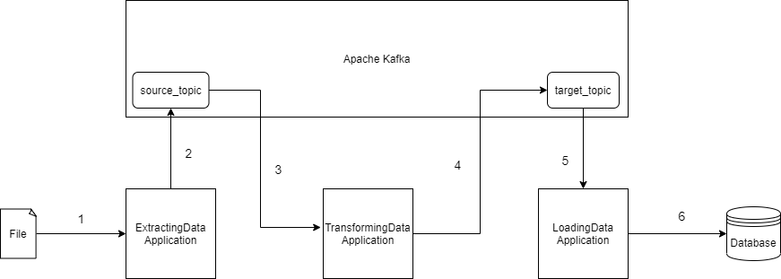
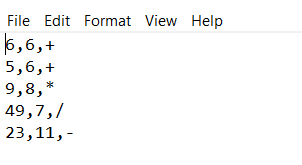
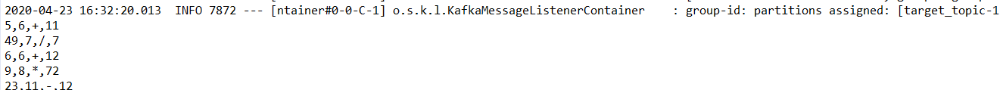

# ETL (Extraction Transformation Loading) Using Spring Boot and Apache Kafka

ETL is short for extract, transform, load, three functions that are combined into one tool to pull data out of one data source and place it into another data source. In this project we will attempt to create the ETL Tool using Spring Boot and Apache Kafka. We will be extracting data from a file, publishing it to a kafka-topic, transforming the data consumed from the topic using kafka-streams and publishing the transformed data to another kafka topic, and finally loading the data to a database. In this project we extract two numbers and a operator from each file record, transfrom the record by adding the result and write it back to the target_topic.

The project consists of three application 

  1. ExtractingData Application
  2. TransformingData Application
  3. LoadingData Application
  
as visible in the diagram. Let's look at the steps involved.

  * In **Step 1** the ExtractingData Application extracts the data using the FileReader from the file. The file is located at C:\\Kafka_Files\\filename.
  * **Step 2** involves publishing the extracted data to the kafka topic named as source_topic.
  * In **Step 3** the TransformingData Application streams the data from the source_topic using kafka-streams API.
  * After performing the required transformation the data is published to the kafka-topic named as target_topic.
  * **Step 5** involves the consumption of data from the target_topic by the LoadingData Application.
  * In **Step 6** we finally load the data to the database using spring data jpa.
  
  **Note:** The above diagram is available in xml format in img folder, to make any changes just import the xml file to [draw.io](https://app.diagrams.net/).
  
#### Pre-requisite

  * Installation of Apache Zookeeper.
  * Installation of Apache Kafka.
  * Creation of Kafka Topics (source\_topic and target\_topic)
  
#### Maven Dependencies
  * ExtractingData Application
  
    1. spring-boot-starter-web
    2. spring-kafka  
  * TransformingData Application
  
    1. kafka-streams
    2. kafka-streams-test-utils
    3. commons-io
    
  * LoadingData Application
  
    1. spring-boot-starter-web
    2. spring-kafka
    3. spring-boot-starter-jpa
    4. h2
    
#### Running the Project

**Step 1:** Starting the Zookeeper server

.\bin\windows\zookeeper-server-start.bat .\config\zookeeper.properties

**Step 2:** Starting the Kafka server

.\bin\windows\kafka-server-start.bat .\config\server.properties

**Step 3:** Creation of required Kafka Topics.

bin\windows\kafka-topics.bat --create --zookeeper localhost:2181 --replication-factor 1 --partitions 2 --topic target_topic.

**Step 4:** Providing input file at defined location which is(C:\\Kafka_Files\\filename). You can change the location in application.properties file.

**Step 5:** Launch the ExtractData Application, it will publish the records line by line.

**Step 6** Launch the TransformingData Application. It will transfrom and publish the data to target_topic.

**Step 7** Launch the LoadingData Application which will start consuming the data from the target_topic and load it to required database.

#### Output

#### Testing the application

We test the project by testing the Streaming Application that is the TransformingData Application. For testing a streaming application we don't need the kafka server running. For this we need kafka-streams-test-utils maven dependency.

####Conclusion

The Loading part to the database can be done directly using the kafka connect sink api. Developers can use required database connectors from any source (confluent,debezium etc) and use it in their project. This will enable them to load the data directly from target_topic.

 

    
  
